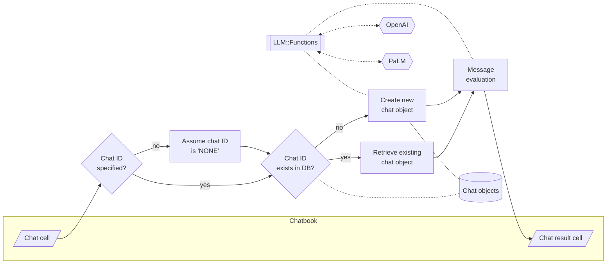

# Jupyter::Chatbook

## In brief

This Raku package is a fork of Brian Duggan's 
["Jupyter::Kernel"](https://github.com/bduggan/raku-jupyter-kernel).

"Jupyter::Kernel" is a pure Raku implementation of a Raku kernel for Jupyter clients¹.

Jupyter notebooks provide a web-based (or console-based)
Read Eval Print Loop (REPL) for running code and serializing input and output.

It is desirable to include the interaction with Large Language Models (LLMs) to the "usual" REPL.

Having LLM-aware and LLM-chat-endowed notebooks (i.e. *chatbooks*) can really speed up the:
- Utilization of Raku 
  - Derivation of useful (actionable) code
- Adoption of Raku by newcomers
- Writing and preparation of documents on variety of subjects

This repository is mostly for experimental work, but it aims to be *always* very
useful for interacting with LLMs via Raku.

**Remark:** The reason to have a separate package -- a fork of
["Jupyter::Kernel"](https://github.com/bduggan/raku-jupyter-kernel) --
is because:
- I plan to introduce 4-6 new package dependencies
- I expect to do a fair amount of UX experimental implementations and refactoring

**Remark:** I am convinced that by using "Jupyter::Kernel" as a base some fairly sophisticated, 
yet natural programming workflows can be produced.


-------

## Installation and setup

Follow the instructions of
["Jupyter::Kernel"](https://github.com/bduggan/raku-jupyter-kernel).

-------

## Using LLMs in chatbooks

There are four ways to use LLMs in a chatbook:

1. LLM functions, [AA3, AAp4]
2. LLM chat objects, [AA4, AAp4]
3. OpenAI, [AAp2], or PaLM, [AAp3], code cells with magics
4. Notebook-wide chats that are distributed over multiple code cells with chat-magic specs

The sub-sections below briefly describe each of these ways and have links to notebooks with
more detailed examples.

### LLM functions 

LLM functions as described in [AA3] are best utilized via a certain REPL tool or environment.
Notebooks are the perfect media for LLM functions workflows. 
Here is an example of a code cell that defines an LLM functions:

```perl6
use LLM::Functions;

my &fcp = llm-function({"What is the population of the country $_ ?"});
```
```
# -> **@args, *%args { #`(Block|5708007162384) ... }
```

Here is another cell that might evaluated multiple times using different country names:

```perl6
&fcp('Botswana')
```
```
# The population of Botswana was 2,323,706 as of July 2020.
```

For more examples of LLM functions and LLM chat objects see the notebook 
["Chatbook-LLM-functions-and-chat-objects.ipynb"](./eg/Chatbook-LLM-functions-and-chat-objects.ipynb).


### LLM cells

Here is an example of a code cell with PaLM magic spec:

```
%%palm, max-tokens=600
Generate a horror story about a little girl lost in the forest and getting possessed.
```

For more examples see the notebook ["Chatbook-LLM-cells.ipynb"](./eg/Chatbook-LLM-cells.ipynb).

### Notebook-wide chats

Chatbooks have the ability to maintain an LLM conversation over multiple notebook cells.
One chatbook can have more than one LLM conversation.

For concrete examples see the notebook ["Chatbook-LLM-chats.ipynb"](./eg/Chatbook-LLM-chats.ipynb).

Here is a flowchart that summarizes the way chatbooks create and utilize LLM chat objects:




-------

## Alternative Raku Literate programming solutions

### Computational Markdown documents

The Raku package
["Text::CodeProcessing"](https://raku.land/zef%3Aantononcube/Text%3A%3ACodeProcessing)
can be used to do 
[Literate programming](https://en.wikipedia.org/wiki/Literate_programming)
with Raku; see [AA1, AAv1].

"Text::CodeProcessing" works with Markdown, Org-mode, and Pod6 files.

Here is typical workflow:

1. One can use a Markdown editor (
[Visual Studio Code](https://en.wikipedia.org/wiki/Visual_Studio_Code) / 
[Emacs](https://www.gnu.org/software/emacs/) / 
[CommaIDE](https://commaide.com) / 
[IntelliJ IDEA](https://www.jetbrains.com/idea/) / 
[One Markdown](https://apps.apple.com/us/app/one-markdown/id1507139439)) 
to write a "work" Markdown document. 

2. That Markdown file can be "executed" using "Text::CodeProcessing". 

3. The obtained, "woven" Markdown file has the results of 
the Raku, Shell, OpenAI, and PaLM code cells in the original document.

4. The content of the "work" document can be refined based in the results displayed in
the "woven" document.

5. If a "more intensive interaction" is needed one of the Markdown files can be converted into a notebook:
   - ["Markdown::Grammar"](https://raku.land/zef:antononcube/Markdown::Grammar), [AAp3], can convert to Mathematica notebooks.
   - ["jupytext"](https://jupytext.readthedocs.io/) can convert to Jupyter notebooks.

See the demo recording
["Raku Literate Programming via command line pipelines"](https://www.youtube.com/watch?v=2UjAdQaKof8), [AAv1], (4.5 min.)

**LLM usage:** Markdown cells with messages to be send to OpenAI or PaLM can be specified.
See [AA2, AA3]. Additionally, Raku has dedicated packages for accessing OpenAI and PaLM,
and the creation of LLM functions and LLM chat objects.

### Mathematica notebooks

The creation of Jupyter notebooks was inspired from
[Mathematica's](https://www.wolfram.com/mathematica/?source=nav)
notebooks. Jupyter, instead of hierarchical S-expressions uses the hierarchical JSON format.

So, instead of using Jupyter's framework for having a *Raku notebook solution*, 
the much more mature framework of Mathematica can be used. See: 

- The Raku package ["Text::CodeProcessing"](https://raku.land/zef%3Aantononcube/Text%3A%3ACodeProcessing), [AAp1]
- The WL paclet ["RakuMode"](https://resources.wolframcloud.com/PacletRepository/resources/AntonAntonov/RakuMode/), [AAp2]

See the demo recordings:
- ["Racoons playing with pearls and onions"](https://www.youtube.com/watch?v=zlkoNZK8MpU), [AAv2]
- ["Streamlining ChatGPT code generation and narration workflows (Raku)"](https://www.youtube.com/watch?v=mI-oWLz5dYY), [AAv2]

**LLM usage (WL):** Fully integrated LLM utilization of all four points in the previous section. See [SW1].

**LLM usage (Raku):** The paclet ["RakuMode"](https://resources.wolframcloud.com/PacletRepository/resources/AntonAntonov/RakuMode/) 
is based the "Chatbook style". 
I.e. Raku can be used in WL chatbooks. Additionally, Raku has dedicated packages for accessing OpenAI and PaLM,
and the creation of LLM functions and LLM chat objects.


**Remark:** The sequential execution of chat cells mentioned in the previous section is heavily
influenced by the chatbooks in Mathematica 13.3. 
Earlier versions of Mathematica WL paclet ["Chatbook"](https://resources.wolframcloud.com/PacletRepository/resources/Wolfram/Chatbook/).

-------

## Motivation extended 

*(... or just a rant...)*

One of my "missions" with Raku is to have a reasonable set of Machine Learning (ML) algorithms implemented (only) with Raku.
Another "mission" is to endow Raku with a Large Language Models (LLMs) system that integrates very well with Raku and Raku's ecosystem.
Having "simple" ML algorithms, integrated LLMs interaction,
and Raku's text processing abilities should produce a very attractive system for doing science and mathematics.
(At least to a point.)

When Raku is "not enough" I am trying to use natural Domain Specific Languages (DSLs) to generate executable code to other programming languages and their ecosystems.
I mostly target Mathematica, R, and Python. (In that order of priority.)
(The DSLs parsers-interpreters are, of course, written in Raku.)

I think the main and most challenging Raku deficiencies for doing science and mathematics are not having:
1. Robust, interactive "notebook solution"
2. Easy to invoke and use graphics system

There are half a dozen efforts for point 1: "Jupyter::Kernel", "Text::CodeProcessing" and "RakuMode", VSCode LSP, Emacs-mode, and maybe others.

I do not consider "Jupyter::Kernel" and "RakuMode" reliable.
For point 2 -- there are a few graphics solutions for Raku. In my opinion none of them:
- Is easy to install and invoke
- And is easy to use
- And produces pretty, tunable, useful graphics

The last point strongly depends upon having a robust interactive notebook solution.


------

## References

### Articles

[AA1] Anton Antonov,
["Literate programming via CLI"](https://rakuforprediction.wordpress.com/2023/03/06/literate-programming-via-cli/),
(2023),
[RakuForPrediction at WordPress](https://rakuforprediction.wordpress.com).

[AA2] Anton Antonov,
["Generating documents via templates and LLMs"](https://rakuforprediction.wordpress.com/2023/07/11/generating-documents-via-templates-and-llms/),
(2023),
[RakuForPrediction at WordPress](https://rakuforprediction.wordpress.com).

[AA3] Anton Antonov,
["Workflows with LLM functions"](https://rakuforprediction.wordpress.com/2023/08/01/workflows-with-llm-functions/),
(2023),
[RakuForPrediction at WordPress](https://rakuforprediction.wordpress.com).

[AA4] Anton Antonov,
["Number guessing games: PaLM vs ChatGPT"](https://rakuforprediction.wordpress.com/2023/08/06/number-guessing-games-palm-vs-chatgpt/),
(2023),
[RakuForPrediction at WordPress](https://rakuforprediction.wordpress.com).

[SW1] Stephen Wolfram,
["Introducing Chat Notebooks: Integrating LLMs into the Notebook Paradigm"](https://writings.stephenwolfram.com/2023/06/introducing-chat-notebooks-integrating-llms-into-the-notebook-paradigm/),
(2023),
[writings.stephenwolfram.com](https://writings.stephenwolfram.com).

### Packages

[AAp1] Anton Antonov,
[Text::CodeProcessing Raku package](https://github.com/antononcube/Raku-Text-CodeProcessing),
(2021),
[GitHub/antononcube](https://github.com/antononcube).

[AAp2] Anton Antonov,
[WWW::OpenAI Raku package](https://github.com/antononcube/Raku-WWW-OpenAI),
(2023),
[GitHub/antononcube](https://github.com/antononcube).

[AAp3] Anton Antonov,
[WWW::PaLM Raku package](https://github.com/antononcube/Raku-WWW-PaLM),
(2023),
[GitHub/antononcube](https://github.com/antononcube).

[AAp4] Anton Antonov,
[LLM::Functions Raku package](https://github.com/antononcube/Raku-LLM-Functions),
(2023),
[GitHub/antononcube](https://github.com/antononcube).

[AAp4] Anton Antonov,
[Text::SubParsers Raku package](https://github.com/antononcube/Raku-Text-SubParsers),
(2023),
[GitHub/antononcube](https://github.com/antononcube).

[AAp5] Anton Antonov,
[Data::Translators Raku package](https://github.com/antononcube/Raku-Data-Translators),
(2023),
[GitHub/antononcube](https://github.com/antononcube).

[AAp4] Anton Antonov,
[Clipboard Raku package](https://github.com/antononcube/Raku-Clipboard),
(2023),
[GitHub/antononcube](https://github.com/antononcube).

[BDp1] Brian Duggan,
[Jupyter:Kernel Raku package](https://github.com/bduggan/raku-jupyter-kernel),
(2017-2023),
[GitHub/bduggan](https://github.com/bduggan).

### Videos

[AAv1] Anton Antonov,
["Raku Literate Programming via command line pipelines"](https://www.youtube.com/watch?v=2UjAdQaKof8),
(2023),
[YouTube/@AAA4Prediction](https://www.youtube.com/@AAA4prediction).

[AAv2] Anton Antonov,
["Racoons playing with pearls and onions"](https://www.youtube.com/watch?v=zlkoNZK8MpU)
(2023),
[YouTube/@AAA4Prediction](https://www.youtube.com/@AAA4prediction).

[AAv3] Anton Antonov,
["Streamlining ChatGPT code generation and narration workflows (Raku)"](https://www.youtube.com/watch?v=mI-oWLz5dYY)
(2023),
[YouTube/@AAA4Prediction](https://www.youtube.com/@AAA4prediction).

------

## *Footnotes*

¹ Jupyter clients are user interfaces to interact with an interpreter kernel like "Jupyter::Kernel".
Jupyter [Lab | Notebook | Console | QtConsole ] are the jupyter maintained clients.
More info in the [jupyter documentations site](https://jupyter.org/documentation).
