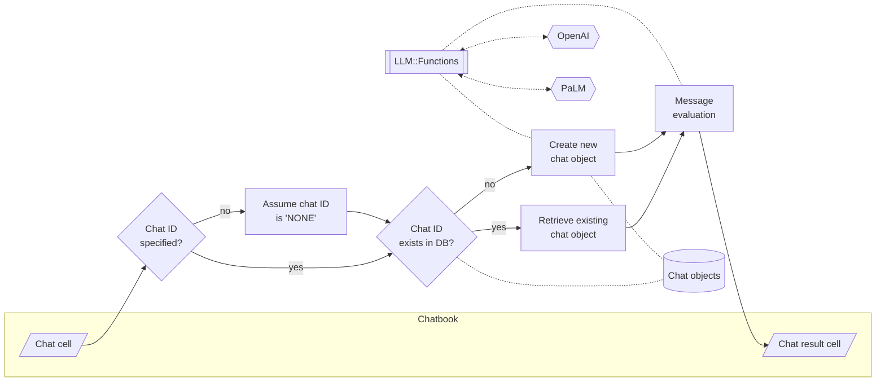

# Jupyter::Chatbook

## In brief

This Raku package is a fork of Brian Duggan's 
["Jupyter::Kernel"](https://github.com/bduggan/raku-jupyter-kernel).

Here are the top opening statements of the README of "Jupyter::Kernel":

> "Jupyter::Kernel" is a pure Raku implementation of a Raku kernel for Jupyter clients¹.

> Jupyter notebooks provide a web-based (or console-based)
Read Eval Print Loop (REPL) for running code and serializing input and output.

It is desirable to include the interaction with Large Language Models (LLMs) to the "typical" 
REPL systems or workflows.

Having LLM-aware and LLM-chat-endowed notebooks -- **chatbooks** -- can really speed up the:
- Writing and preparation of documents on variety of subjects
- Derivation of useful Raku (actionable) code
- Adoption of Raku by newcomers

This repository is mostly for experimental work, but it aims to be *always* very
useful for interacting with LLMs via Raku.

**Remark:** The reason to have a separate package -- a fork of
["Jupyter::Kernel"](https://github.com/bduggan/raku-jupyter-kernel) --
is because:
- I plan to introduce 4-6 new package dependencies
- I expect to do a fair amount of UX experimental implementations and refactoring

-------

## Installation and setup

From ["Zef ecosystem"](https://raku.land):

```
zef install Jupyter::Chatbook
```

From GitHub:

```
zef install https://github.com/antononcube/Raku-Jupyter-Chatbook.git
```


After installing the package "Jupyter::Chatbook" follow the setup instructions of
["Jupyter::Kernel"](https://github.com/bduggan/raku-jupyter-kernel).

-------

## Using LLMs in chatbooks

There are four ways to use LLMs in a chatbook:

1. [LLM functions](https://github.com/antononcube/Raku-Jupyter-Chatbook/blob/master/eg/Chatbook-LLM-functions-and-chat-objects.ipynb), [AA3, AAp4]
2. [LLM chat objects](https://github.com/antononcube/Raku-Jupyter-Chatbook/blob/master/eg/Chatbook-LLM-functions-and-chat-objects.ipynb), [AA4, AAp4]
3. OpenAI, [AAp2], or PaLM, [AAp3], [code cells with magics](https://github.com/antononcube/Raku-Jupyter-Chatbook/blob/master/eg/Chatbook-LLM-cells.ipynb)
4. [Notebook-wide chats](https://github.com/antononcube/Raku-Jupyter-Chatbook/blob/master/eg/Chatbook-LLM-chats.ipynb) 
   that are distributed over multiple code cells with chat-magic specs

The sections below briefly describe each of these ways and have links to notebooks with
more detailed examples.

-------

## LLM functions and chat objects

LLM functions as described in [AA3] are best utilized via a certain REPL tool or environment.
Notebooks are the perfect media for LLM functions workflows. 
Here is an example of a code cell that defines an LLM function:

```perl6
use LLM::Functions;

my &fcp = llm-function({"What is the population of the country $_ ?"});
```
```
# -> **@args, *%args { #`(Block|4150649103136) ... }
```

Here is another cell that can be evaluated multiple times using different country names:

```perl6
<Niger Gabon>.map({ &fcp($_) })
```
```
# (
# 
# As of July 2020, the population of Niger is estimated to be 24,128,741. 
# 
# As of 2019, the estimated population of Gabon is 2,278,286.)
```

For more examples of LLM functions and LLM chat objects see the notebook 
["Chatbook-LLM-functions-and-chat-objects.ipynb"](./eg/Chatbook-LLM-functions-and-chat-objects.ipynb).


-------

## LLM cells

The LLMs of OpenAI (ChatGPT, DALL-E) and Google (PaLM) can be interacted with using "dedicated" notebook cells.

Here is an example of a code cell with PaLM magic spec:

```
%% palm, max-tokens=600
Generate a horror story about a little girl lost in the forest and getting possessed.
```

For more examples see the notebook ["Chatbook-LLM-cells.ipynb"](./eg/Chatbook-LLM-cells.ipynb).

------

## Notebook-wide chats

Chatbooks have the ability to maintain LLM conversations over multiple notebook cells.
A chatbook can have more than one LLM conversations.
"Under the hood" each chatbook maintains a database of chat objects.
Chat cells are used to give messages to those chat objects.

For example, here is a chat cell with which a new "Email Writer" chat object is made,
and that new chat object has the identifier "em12":  

```
%% chat-em12, prompt = «Given a topic, write emails in a concise, professional manner»
Write a vacation email.
```

Here is a chat cell in which another message is given to the chat object with identifier "em12":

```
%% chat-em12
Rewrite with manager's name being Jane Doe, and start- and end dates being 8/20 and 9/5.
```

In this chat cell a new chat object is created:

```
%% chat-snowman, prompt = ⎡Pretend you are a friendly snowman. Stay in character for every response you give me. Keep your responses short.⎦
Hi!
```

And here is a chat cell that sends another message to the "snowman" chat object:

```
%% chat-snowman
Who build you? Where?
```

**Remark:** Specifying a chat object identifier is not required. I.e. only the magic spec `%% chat` can be used.
The "default" chat object ID identifier "NONE".

For more examples see the notebook ["Chatbook-LLM-chats.ipynb"](./eg/Chatbook-LLM-chats.ipynb).

Here is a flowchart that summarizes the way chatbooks create and utilize LLM chat objects:



------

## TODO

1. [ ] TODO Features
   1. [ ] TODO DSL G4T cells
   2. [ ] TODO Chat-meta cells (simple)
   3. [ ] TODO Chat-meta cells (via LLM)
2. [ ] TODO Unit tests
   1. [X] DONE PaLM cells
   2. [X] DONE OpenAI cells
   3. [X] DONE MermaidInk cells
   4. [ ] TODO DALL-E cells
3. [ ] TODO Documentation
   1. [ ] TODO Long chat
   2. [ ] TODO All parameters of OpenAI API in Raku
   3. [ ] TODO All parameters of PaLM API in Raku
   4. [ ] TODO More details on prompts
   5. [ ] TODO Introductory video(s)

------

## References

### Articles

[AA1] Anton Antonov,
["Literate programming via CLI"](https://rakuforprediction.wordpress.com/2023/03/06/literate-programming-via-cli/),
(2023),
[RakuForPrediction at WordPress](https://rakuforprediction.wordpress.com).

[AA2] Anton Antonov,
["Generating documents via templates and LLMs"](https://rakuforprediction.wordpress.com/2023/07/11/generating-documents-via-templates-and-llms/),
(2023),
[RakuForPrediction at WordPress](https://rakuforprediction.wordpress.com).

[AA3] Anton Antonov,
["Workflows with LLM functions"](https://rakuforprediction.wordpress.com/2023/08/01/workflows-with-llm-functions/),
(2023),
[RakuForPrediction at WordPress](https://rakuforprediction.wordpress.com).

[AA4] Anton Antonov,
["Number guessing games: PaLM vs ChatGPT"](https://rakuforprediction.wordpress.com/2023/08/06/number-guessing-games-palm-vs-chatgpt/),
(2023),
[RakuForPrediction at WordPress](https://rakuforprediction.wordpress.com).

[SW1] Stephen Wolfram,
["Introducing Chat Notebooks: Integrating LLMs into the Notebook Paradigm"](https://writings.stephenwolfram.com/2023/06/introducing-chat-notebooks-integrating-llms-into-the-notebook-paradigm/),
(2023),
[writings.stephenwolfram.com](https://writings.stephenwolfram.com).

### Packages

[AAp1] Anton Antonov,
[Text::CodeProcessing Raku package](https://github.com/antononcube/Raku-Text-CodeProcessing),
(2021),
[GitHub/antononcube](https://github.com/antononcube).

[AAp2] Anton Antonov,
[WWW::OpenAI Raku package](https://github.com/antononcube/Raku-WWW-OpenAI),
(2023),
[GitHub/antononcube](https://github.com/antononcube).

[AAp3] Anton Antonov,
[WWW::PaLM Raku package](https://github.com/antononcube/Raku-WWW-PaLM),
(2023),
[GitHub/antononcube](https://github.com/antononcube).

[AAp4] Anton Antonov,
[LLM::Functions Raku package](https://github.com/antononcube/Raku-LLM-Functions),
(2023),
[GitHub/antononcube](https://github.com/antononcube).

[AAp4] Anton Antonov,
[Text::SubParsers Raku package](https://github.com/antononcube/Raku-Text-SubParsers),
(2023),
[GitHub/antononcube](https://github.com/antononcube).

[AAp5] Anton Antonov,
[Data::Translators Raku package](https://github.com/antononcube/Raku-Data-Translators),
(2023),
[GitHub/antononcube](https://github.com/antononcube).

[AAp4] Anton Antonov,
[Clipboard Raku package](https://github.com/antononcube/Raku-Clipboard),
(2023),
[GitHub/antononcube](https://github.com/antononcube).

[BDp1] Brian Duggan,
[Jupyter:Kernel Raku package](https://github.com/bduggan/raku-jupyter-kernel),
(2017-2023),
[GitHub/bduggan](https://github.com/bduggan).

### Videos

[AAv1] Anton Antonov,
["Raku Literate Programming via command line pipelines"](https://www.youtube.com/watch?v=2UjAdQaKof8),
(2023),
[YouTube/@AAA4Prediction](https://www.youtube.com/@AAA4prediction).

[AAv2] Anton Antonov,
["Racoons playing with pearls and onions"](https://www.youtube.com/watch?v=zlkoNZK8MpU)
(2023),
[YouTube/@AAA4Prediction](https://www.youtube.com/@AAA4prediction).

[AAv3] Anton Antonov,
["Streamlining ChatGPT code generation and narration workflows (Raku)"](https://www.youtube.com/watch?v=mI-oWLz5dYY)
(2023),
[YouTube/@AAA4Prediction](https://www.youtube.com/@AAA4prediction).

------

## *Footnotes*

¹ Jupyter clients are user interfaces to interact with an interpreter kernel like "Jupyter::Kernel".
Jupyter [Lab | Notebook | Console | QtConsole ] are the jupyter maintained clients.
More info in the [jupyter documentations site](https://jupyter.org/documentation).
