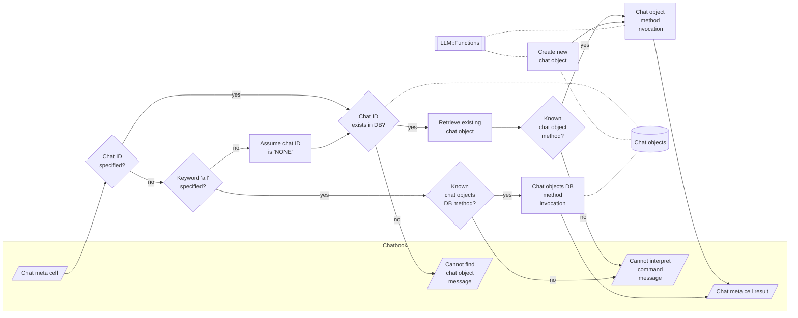

# Jupyter::Chatbook

[](https://raku.land/zef:antononcube/Jupyter::Chatbook)

## In brief

This Raku package is a fork of Brian Duggan's 
["Jupyter::Kernel"](https://github.com/bduggan/raku-jupyter-kernel), [BDp1].

Here are the top opening statements of the README of "Jupyter::Kernel":

> "Jupyter::Kernel" is a pure Raku implementation of a Raku kernel for Jupyter clients¹.

> Jupyter notebooks provide a web-based (or console-based)
Read Eval Print Loop (REPL) for running code and serializing input and output.

It is desirable to include the interaction with Large Language Models (LLMs) into 
the "typical" REPL systems or workflows. Having LLM-aware and LLM-chat-endowed 
notebooks -- **chatbooks** -- can really speed up the:
- Writing and preparation of documents on variety of subjects
- Derivation of useful programming code
- Adoption of programming languages by newcomers

This repository is mostly for experimental work, but it aims to be *always* very
useful for interacting with LLMs via Raku.

**Remark:** The reason to have a separate package -- a fork of
["Jupyter::Kernel"](https://github.com/bduggan/raku-jupyter-kernel) --
is because:
- I plan to introduce 4-6 new package dependencies
- I expect to do a fair amount of UX experimental implementations and refactoring

-------

## Installation and setup

From ["Zef ecosystem"](https://raku.land):

```
zef install Jupyter::Chatbook
```

From GitHub:

```
zef install https://github.com/antononcube/Raku-Jupyter-Chatbook.git
```

After installing the package "Jupyter::Chatbook" follow the setup instructions of
["Jupyter::Kernel"](https://github.com/bduggan/raku-jupyter-kernel).

The default API keys for the chat cells, LLM functions, and chat objects are taken from 
the Operating System (OS) environmental variables `OPENAI_API_KEY` and `PALM_API_KEY`. 
The api keys can also be specified using LLM evaluator and configuration options and objects; 
see [AA3, AAp2].

-------

## Using LLMs in chatbooks

There are four ways to use LLMs in a chatbook:

1. [LLM functions](https://github.com/antononcube/Raku-Jupyter-Chatbook/blob/master/eg/Chatbook-LLM-functions-and-chat-objects.ipynb), [AA3, AAp2]
2. [LLM chat objects](https://github.com/antononcube/Raku-Jupyter-Chatbook/blob/master/eg/Chatbook-LLM-functions-and-chat-objects.ipynb), [AA4, AAp2]
3. [Code cells with magics](https://github.com/antononcube/Raku-Jupyter-Chatbook/blob/master/eg/Chatbook-LLM-cells.ipynb)
   accessing LLMs, like, OpenAI's, [AAp3], or PaLM's, [AAp4]
4. [Notebook-wide chats](https://github.com/antononcube/Raku-Jupyter-Chatbook/blob/master/eg/Chatbook-LLM-chats.ipynb) 
   that are distributed over multiple code cells with chat-magic specs

The sections below briefly describe each of these ways and have links to notebooks with
more detailed examples.

-------

## LLM functions and chat objects

LLM functions as described in [AA3] are best utilized via a certain REPL tool or environment.
Notebooks are the perfect media for LLM functions workflows. 
Here is an example of a code cell that defines an LLM function:

```perl6
use LLM::Functions;

my &fcp = llm-function({"What is the population of the country $_ ?"});
```
```
# -> **@args, *%args { #`(Block|2762033389368) ... }
```

Here is another cell that can be evaluated multiple times using different country names:

```perl6
<Niger Gabon>.map({ &fcp($_) })
```
```
# (
# 
# As of July 2020, the population of Niger is estimated to be 22,843,737 people. 
# 
# According to the World Bank, the population of Gabon is 2,222,948 as of July 2020.)
```

For more examples of LLM functions and LLM chat objects see the notebook 
["Chatbook-LLM-functions-and-chat-objects.ipynb"](https://github.com/antononcube/Raku-Jupyter-Chatbook/blob/master/eg/Chatbook-LLM-functions-and-chat-objects.ipynb).

**Remark:** 
Chatbooks load in their initialization phase the package
["LLM::Functions"](https://github.com/antononcube/Raku-LLM-Functions), [AAp2].
Also, in the initialization phase are loaded the packages
["Clipboard"](https://github.com/antononcube/Raku-Clipboard), [AAp5],
["Data::Translators"](https://github.com/antononcube/Raku-Data-Translators), [AAp6],
["Data::TypeSystem"](https://github.com/antononcube/Raku-Data-Translators), [AAp7],
["Text::Plot"](https://github.com/antononcube/Raku-Text-Plot), [AAp8],
and
["Text::SubParsers"](https://github.com/antononcube/Raku-Text-SubParsers), [AAp9],
that can be used to post-process LLM outputs.

-------

## LLM cells

The LLMs of OpenAI (ChatGPT, DALL-E) and Google (PaLM) can be interacted with using "dedicated" notebook cells.

Here is an example of a code cell with PaLM magic spec:

```
%% palm, max-tokens=600
Generate a horror story about a little girl lost in the forest and getting possessed.
```

For more examples see the notebook 
["Chatbook-LLM-cells.ipynb"](https://github.com/antononcube/Raku-Jupyter-Chatbook/blob/master/eg/Chatbook-LLM-cells.ipynb).

------

## Notebook-wide chats

Chatbooks have the ability to maintain LLM conversations over multiple notebook cells.
A chatbook can have more than one LLM conversations.
"Under the hood" each chatbook maintains a database of chat objects.
Chat cells are used to give messages to those chat objects.

For example, here is a chat cell with which a new 
["Email writer"](https://developers.generativeai.google/prompts/email-writer) 
chat object is made, and that new chat object has the identifier "em12":  

```
%% chat-em12, prompt = «Given a topic, write emails in a concise, professional manner»
Write a vacation email.
```

Here is a chat cell in which another message is given to the chat object with identifier "em12":

```
%% chat-em12
Rewrite with manager's name being Jane Doe, and start- and end dates being 8/20 and 9/5.
```

In this chat cell a new chat object is created:

```
%% chat snowman, prompt = ⎡Pretend you are a friendly snowman. Stay in character for every response you give me. Keep your responses short.⎦
Hi!
```

And here is a chat cell that sends another message to the "snowman" chat object:

```
%% chat snowman
Who build you? Where?
```

**Remark:** Specifying a chat object identifier is not required. I.e. only the magic spec `%% chat` can be used.
The "default" chat object ID identifier "NONE".

**Remark:** The magic keyword "chat" can be separated from the identifier of the chat object with
the symbols "-", "_", ":", or with any number of (horizontal) white spaces.

For more examples see the notebook 
["Chatbook-LLM-chats.ipynb"](https://github.com/antononcube/Raku-Jupyter-Chatbook/blob/master/eg/Chatbook-LLM-chats.ipynb).

Here is a flowchart that summarizes the way chatbooks create and utilize LLM chat objects:


------

## Chat meta cells

Each chatbook session has a Hash of chat objects.
Chatbooks can have chat meta cells that allow the access of the chat object "database" as whole, 
or its individual objects.  

Here is an example of a chat meta cell (that applies the method `say` to the chat object with ID "snowman"):

```
%% chat snowman meta
say
```

Here is an example of chat meta cell that creates a new chat chat object with the LLM prompt
specified in the cell
(["Guess the word"](https://developers.generativeai.google/prompts/guess-the-word)):

```
%% chat-WordGuesser prompt
We're playing a game. I'm thinking of a word, and I need to get you to guess that word. 
But I can't say the word itself. 
I'll give you clues, and you'll respond with a guess. 
Your guess should be a single word only.
```

Here is a table with examples of magic specs for chat meta cells and their interpretation:

| cell magic line  | cell content                         | interpretation                                                  |
|:-----------------|:-------------------------------------|:----------------------------------------------------------------|
| chat-ew12 meta   | say                                  | Give the "print out" of the chat object with ID "ew12"          |   
| chat-ew12 meta   | messages                             | Give the "print out" of the chat object with ID "ew12"          |   
| chat sn22 prompt | You pretend to be a melting snowman. | Create a chat object with ID "sn22" with the prompt in the cell |   
| chat meta all    | keys                                 | Show the keys of the session chat objects DB                    |   
| chat all         | keys                                 | *«same as above»*                                               |   

Here is a flowchart that summarizes the chat meta cell processing:



------

## TODO

1. [ ] TODO Features
   1. [X] DONE Chat-meta cells (simple)
      - [X] DONE meta  
      - [X] DONE all  
      - [X] DONE prompt  
   2. [ ] TODO Chat-meta cells (via LLM)
   3. [ ] TODO DSL G4T cells
   4. [ ] TODO Using pre-prepared prompts
      - This requires implementing "LLM::Prompts".
        - And populating it with a good number of prompts.
2. [ ] TODO Unit tests
   1. [X] DONE PaLM cells
   2. [X] DONE OpenAI cells
   3. [X] DONE MermaidInk cells
   4. [ ] TODO DALL-E cells
   5. [X] DONE Chat meta cells
3. [ ] TODO Documentation
   - [X] DONE LLM functions and chat objects in chatbooks
   - [X] DONE LLM cells in chatbooks
   - [X] DONE Notebook-wide chats and chat meta cells 
   - [ ] TODO All parameters of OpenAI API in Raku
   - [ ] TODO All parameters of PaLM API in Raku
   - [ ] TODO More details on prompts
   - [ ] TODO Introductory video(s)

------

## References

### Articles

[AA1] Anton Antonov,
["Literate programming via CLI"](https://rakuforprediction.wordpress.com/2023/03/06/literate-programming-via-cli/),
(2023),
[RakuForPrediction at WordPress](https://rakuforprediction.wordpress.com).

[AA2] Anton Antonov,
["Generating documents via templates and LLMs"](https://rakuforprediction.wordpress.com/2023/07/11/generating-documents-via-templates-and-llms/),
(2023),
[RakuForPrediction at WordPress](https://rakuforprediction.wordpress.com).

[AA3] Anton Antonov,
["Workflows with LLM functions"](https://rakuforprediction.wordpress.com/2023/08/01/workflows-with-llm-functions/),
(2023),
[RakuForPrediction at WordPress](https://rakuforprediction.wordpress.com).

[AA4] Anton Antonov,
["Number guessing games: PaLM vs ChatGPT"](https://rakuforprediction.wordpress.com/2023/08/06/number-guessing-games-palm-vs-chatgpt/),
(2023),
[RakuForPrediction at WordPress](https://rakuforprediction.wordpress.com).

[SW1] Stephen Wolfram,
["Introducing Chat Notebooks: Integrating LLMs into the Notebook Paradigm"](https://writings.stephenwolfram.com/2023/06/introducing-chat-notebooks-integrating-llms-into-the-notebook-paradigm/),
(2023),
[writings.stephenwolfram.com](https://writings.stephenwolfram.com).

### Packages

[AAp1] Anton Antonov,
[Jupyter::Chatbook Raku package](https://github.com/antononcube/Raku-Jupyter-Chatbook),
(2023),
[GitHub/antononcube](https://github.com/antononcube).

[AAp2] Anton Antonov,
[LLM::Functions Raku package](https://github.com/antononcube/Raku-LLM-Functions),
(2023),
[GitHub/antononcube](https://github.com/antononcube).

[AAp3] Anton Antonov,
[WWW::OpenAI Raku package](https://github.com/antononcube/Raku-WWW-OpenAI),
(2023),
[GitHub/antononcube](https://github.com/antononcube).

[AAp4] Anton Antonov,
[WWW::PaLM Raku package](https://github.com/antononcube/Raku-WWW-PaLM),
(2023),
[GitHub/antononcube](https://github.com/antononcube).

[AAp5] Anton Antonov,
[Clipboard Raku package](https://github.com/antononcube/Raku-Clipboard),
(2023),
[GitHub/antononcube](https://github.com/antononcube).

[AAp6] Anton Antonov,
[Data::Translators Raku package](https://github.com/antononcube/Raku-Data-Translators),
(2023),
[GitHub/antononcube](https://github.com/antononcube).

[AAp7] Anton Antonov,
[Data::TypeSystem Raku package](https://github.com/antononcube/Raku-Data-TypeSystem),
(2023),
[GitHub/antononcube](https://github.com/antononcube).

[AAp8] Anton Antonov,
[Text::Plot Raku package](https://github.com/antononcube/Raku-Text-Plot),
(2022),
[GitHub/antononcube](https://github.com/antononcube).

[AAp9] Anton Antonov,
[Text::SubParsers Raku package](https://github.com/antononcube/Raku-Text-SubParsers),
(2023),
[GitHub/antononcube](https://github.com/antononcube).

[BDp1] Brian Duggan,
[Jupyter:Kernel Raku package](https://github.com/bduggan/raku-jupyter-kernel),
(2017-2023),
[GitHub/bduggan](https://github.com/bduggan).

### Videos

[AAv1] Anton Antonov,
["Raku Literate Programming via command line pipelines"](https://www.youtube.com/watch?v=2UjAdQaKof8),
(2023),
[YouTube/@AAA4Prediction](https://www.youtube.com/@AAA4prediction).

[AAv2] Anton Antonov,
["Racoons playing with pearls and onions"](https://www.youtube.com/watch?v=zlkoNZK8MpU)
(2023),
[YouTube/@AAA4Prediction](https://www.youtube.com/@AAA4prediction).

[AAv3] Anton Antonov,
["Streamlining ChatGPT code generation and narration workflows (Raku)"](https://www.youtube.com/watch?v=mI-oWLz5dYY)
(2023),
[YouTube/@AAA4Prediction](https://www.youtube.com/@AAA4prediction).

------

## *Footnotes*

¹ Jupyter clients are user interfaces to interact with an interpreter kernel like "Jupyter::Kernel".
Jupyter [Lab | Notebook | Console | QtConsole ] are the jupyter maintained clients.
More info in the [jupyter documentations site](https://jupyter.org/documentation).
